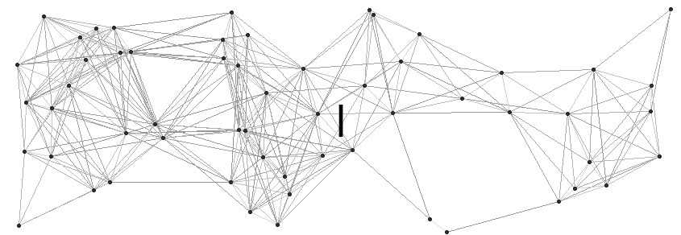
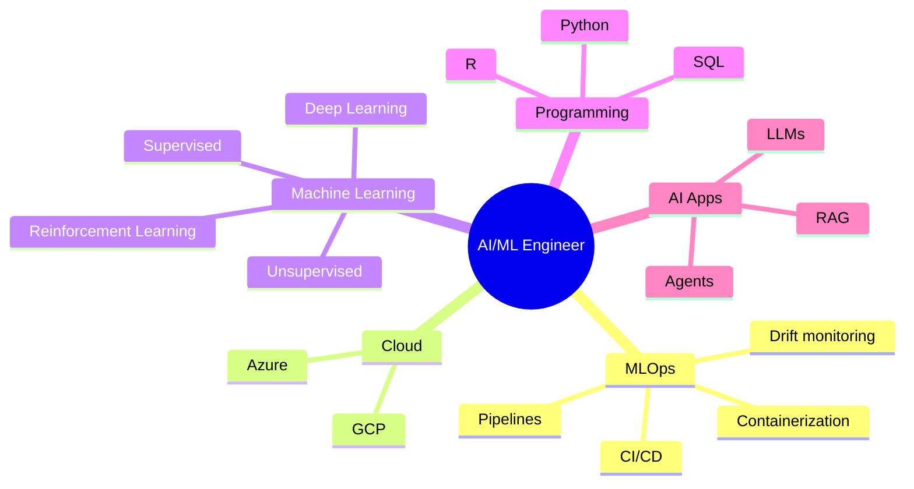

<h1 align="center">
  
</h1>

## About me

<table>
  <tr>
    <td width="33%" align="center" bgcolor="#F3F4F6">
      
       
      Growing professionally while learning about AI engineering, Ops principles and cloud systems
    </td>
    <td width="33%" align="center" bgcolor="#EAF2FF">
      
       
      Preparing for the Professional ML Engineer certification
    </td>
    <td width="33%" align="center" bgcolor="#F1ECFF">
      
       
      Curious about how technology can help solve real-world problems
    </td>
  </tr>
</table>

##  Areas and tools I work with

  
  
  
  
  
  
  
  
  
  
  
  
  
  
  

## Let's connect

  Open to AI/ML engineering opportunities, collaborations and technical conversations.

  
  

